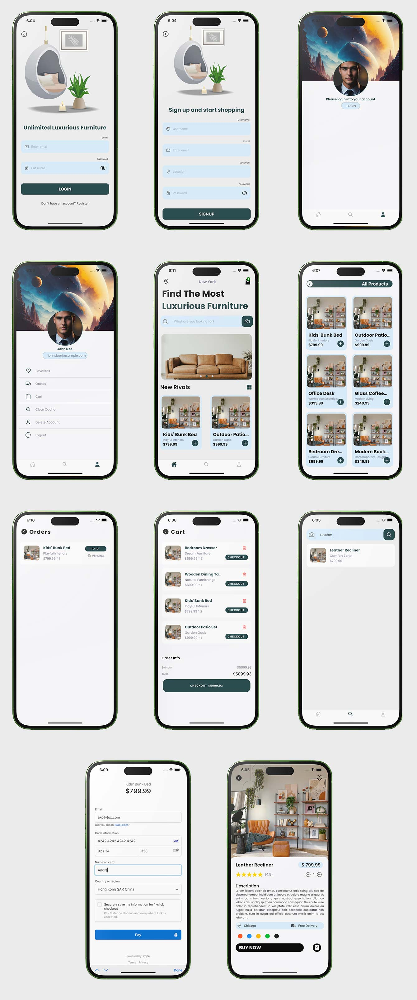

# Furniture E-commerce App

This is a **furniture e-commerce app** project using **React Native**. Our app consists of a **NodeJS** Backend, a separate stripe Node server, and a React Native - Expo front end.

# App features

1. Registration with email

2. Email login

3. Viewing products latest products

4. Protective layer for un-logged used

5. Storing data in local storage using AsyncStorage

6. Adding and removing favorites

7. Add and remove products from the cart

8. View cart

9. Viewing orders and delivery status

10. Stripe payment

11. Search

12. Logout

13. Clear cache data

# Frontend

This mobile application has been developed using **React Native / Expo**, a popular framework for building cross-platform apps. The design process focused on incorporating the following key components: **Text, TouchableOpacity, TextInput, StyleSheet, Image, ActivityIndicator, View, SafeArea, ScrollView, FlatList, and Alert**.

To ensure code cleanliness and organization, the styles have been extracted into a separate file and imported into the relevant components where they are utilized. This approach promotes code modularity and maintainability.

## State Management

In React components, there are two types of data that govern their behavior: props and state. **Props** are set by the parent component and remain fixed throughout the component's lifespan. On the other hand, **state** is used for data that can change over time. For clarification let’s take one use case of how we are going to be managing our state in our app. When capturing the changes in a text Input, this data changes every time a user type something in the text Input, so every time there’s is a change **setState** is called **onChangedText** to store the context of the TextInput.

As good practice we initialize state in the constructor of a component. When you want to modify the state, using the setState method provided by React.

# Backend

For the backend development of this application, we have chosen to use **Node.js with the Express** framework. We will utilize the following packages to enhance functionality: **jsonwebtoken, nodemon, express, mongoose, crypto-js, dotenv**

By the end of this project, I gain proficiency in:

1. **Node Mongo (CRUD)**: Performing Create, Read, Update, and Delete operations on a MongoDB database using Node.js and mongoose.

2. **Obtain access token with jwt**: Generating and validating JWTs for user authentication and authorization in your Node.js application.

3. **Node.js RESTful API**: Building RESTful APIs using Node.js and Express, handling HTTP requests, implementing CRUD operations, and delivering JSON responses.

# Stripe Server

To ensure modularity and reusability, our application's backend architecture separates the Stripe server from the app server. This separation allows us to seamlessly integrate the server with different applications, regardless of the underlying backend framework as long as the order models are the same. Additionally, it helps distribute the server load effectively, reducing the strain on our main server.

The payment server plays a crucial role in handling order payment-related tasks and order creation upon successful payment. Stripe webhooks serve as the key mechanism for capturing responses from Stripe. When a payment is flagged as successful, we leverage these webhooks to receive the necessary information and trigger the creation of corresponding orders. Furthermore, we utilize the webhook data to provide real-time feedback to users regarding the success or failure of their payment attempts.

By maintaining a connection between the payment server and our app database, we ensure seamless data integration. This allows us to easily access and retrieve all the orders created in the payment server. Consequently, we can obtain comprehensive order information and present it to users or perform any other necessary operations.
